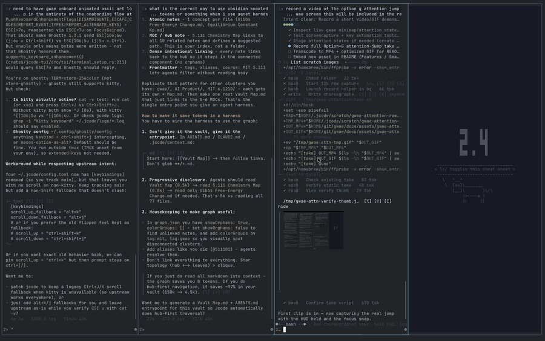

<div align="center">


# gwae

[](https://github.com/hongnoul/gwae/releases)
[](https://github.com/hongnoul/gwae/actions/workflows/ci.yml)
[](LICENSE)

**Scrolling tiling for the terminal. Panes never shrink.**


Not sped up - you can go much faster than demo

```bash
curl -fsSL https://hongnoul.github.io/gwae/install.sh | bash
```

[Website](https://hongnoul.github.io/gwae/) · [Docs](docs/) · [Releases](https://github.com/hongnoul/gwae/releases)

</div>

## Install

```bash
curl -fsSL https://hongnoul.github.io/gwae/install.sh | bash
```

Installs to `~/.local/bin`. Override with `GWAE_INSTALL_DIR`.

<details>
<summary>Other install methods</summary>

```bash
brew install hongnoul/tap/gwae
cargo install gwae
```

Windows:

```powershell
irm https://hongnoul.github.io/gwae/install.ps1 | iex
scoop bucket add gwae https://github.com/hongnoul/scoop-bucket; scoop install gwae
```

Or download from [Releases](https://github.com/hongnoul/gwae/releases/latest).

</details>

## Run

```bash
gwae                  # start
gwae init             # theme and layout setup, safe to re-run
gwae run "claude"     # open agent in first column
gwae doctor           # check config and setup
```

New columns appear to the right of focus. `⌥+;` spawns an agent and focuses it.

## How it works

* Panes keep fixed width (`1/4` default, `⌥+r` to cycle). Rows scroll past the edge, they do not squeeze.
* Scroll snaps to column boundaries. No slivers.
* One process. No daemon, no socket. Agent persistence is `claude --resume` or `jcode --resume`.
* Any terminal on macOS and Linux. Windows builds natively via ConPTY, experimental.
* Kitty graphics forwarded and clipped to pane.

## Agent status

Uses standard [OSC 133](https://gitlab.freedesktop.org/terminal-wg/specifications/-/blob/master/docs/OSC-133.md). No agent changes needed.

`»` working · `!` needs input · `✓` done · `✗` failed

Hold `⌥` for dashboard. `⌥+g` jumps to the pane that needs you.



<video src="docs/assets/gwae-attention.mp4" autoplay loop muted playsinline width="900"></video>

## Keys

All chords use `⌥` on macOS, `Alt` elsewhere. Other keys go to the focused pane.

```
⌥+Enter        new column to right of focus
⌥+Shift+Enter  new strip below
⌥+;            spawn agent
⌥+h/j/k/l      focus left/down/up/right
⌥+Shift+h/j/k/l move pane
⌥+g            jump to pane that needs attention
⌥+t            theme picker
⌥+w            keep Mac awake (focus ring turns red)
⌥+/            help
⌥+q            kill pane
click          focus pane
drag           select and copy
```

Full list: [docs/KEYBINDS.md](docs/KEYBINDS.md)

## Config

File: `~/.config/gwae/gwae.toml` (`$XDG_CONFIG_HOME/gwae/gwae.toml`). All keys optional.

```toml
default_column_width = "quarter"
theme = "catppuccin-mocha"
default_agent = "claude"
startup_panes = 1
```

See [docs/CONFIG.md](docs/CONFIG.md).

## Docs

[Why gwae](docs/WHY.md) · [Architecture](docs/ARCHITECTURE.md) · [Layout spec](docs/LAYOUT-SPEC.md) · [Latency](docs/LATENCY.md) · [Comparison](docs/COMPARISON.md)

## License

[MIT](LICENSE)
