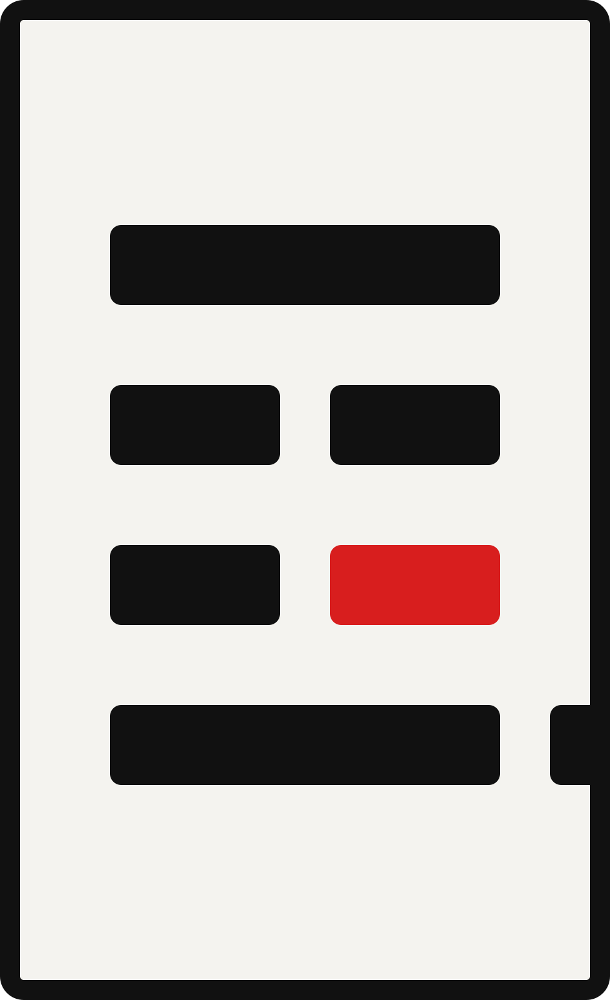
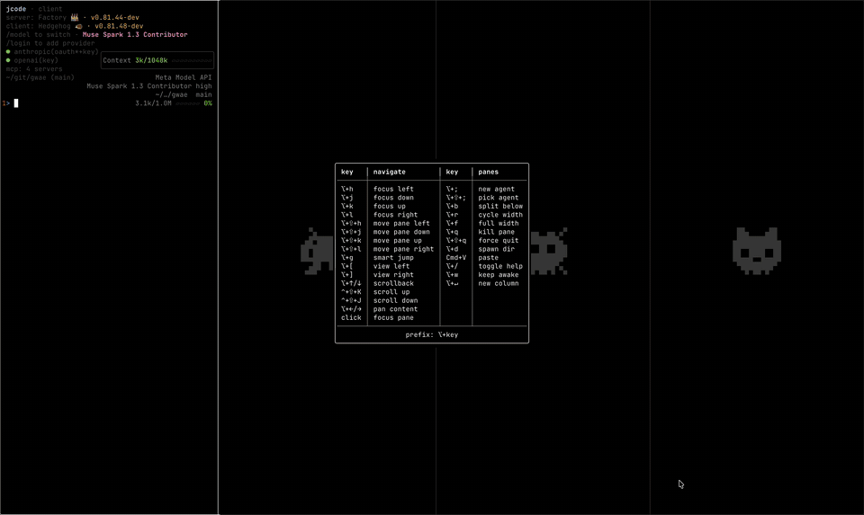

<div align="center">



# gwae

[](https://github.com/hongnoul/gwae/releases)
[](https://github.com/hongnoul/gwae/actions/workflows/ci.yml)
[](LICENSE)

**Run six coding agents side by side. Panes never shrink — the viewport scrolls instead.**

Any terminal, macOS / Linux / Windows. One process, no daemon.



Two agents and a system monitor, each at full width on the strip grid, with placeholder boxes tiling the empty columns. Nothing is sped up.

```bash
curl -fsSL https://hongnoul.github.io/gwae/install.sh | bash   # macOS & Linux
brew install hongnoul/tap/gwae                                 # Homebrew
cargo install gwae                                                                         # Rust 1.85+
```

[Website](https://hongnoul.github.io/gwae/) · [Quick Start](#quick-start) · [Keyboard Shortcuts](#keyboard-shortcuts) · [Why gwae?](#why-gwae) · [FAQ](#faq) · [Docs](docs/)

</div>

---

## Quick start

```sh
gwae                     # one strip, one 1/4-width pane + placeholder boxes
gwae run "claude"        # command runs in column 0, rest are shells ($SHELL)
gwae new -- htop         # (subcommand form) new column in a fresh session
gwae init                # guided setup: theme, layout, chrome (safe to re-run)
gwae setup               # optional per-terminal bindings (e.g. Cmd+hjkl on iTerm2/kitty)
gwae upgrade             # move to the latest release the same way you installed
gwae doctor              # diagnostics: config + theme validity, update route, layout smoke
```

The default layout is one strip, one quarter-width column. Skeleton placeholders tile the empty right side so the 4-column container always reads. New columns appear to the right of the focused pane, not at the strip end. `⌥+;` spawns your agent in a new column and focuses it.

## Features

**Panes never shrink**
Fixed-width columns (`1/4` by default, `1/3 → 1/2 → 1/4` on `⌥+r`). A row that outgrows the screen scrolls past the viewport edge — it doesn't cram. Strips stack infinitely downward.

**Quantized scroll**
The viewport rests only on column boundaries, so the same grid paints pixel-identically in every scroll state. No slivers, no wobble — verified end-to-end at hostile widths like 342 columns.

**Agent dashboard**
Panes speak standard [OSC 133](https://gitlab.freedesktop.org/terminal-wg/specifications/-/blob/master/docs/OSC-133.md) — zero instrumentation. Hold `⌥` for a minimap tinted by status (working / wants attention / done / failed) and press `⌥+g` to smart-jump to the pane that needs you.

**Hot reload in dev**
`GWAE_DEV_RELOAD=1` plus `./scripts/hot.sh`: save a file, and the running gwae swaps in the new build *in place*, keeping every pane and its agent alive. Same pid, same PTYs, no daemon. See [docs/ARCHITECTURE.md](docs/ARCHITECTURE.md#hot-reload-dev-new-code-same-panes).

**Single process, no daemon**
No socket, no attach/detach. Crashing one pane's emulator can't take the TUI down. Persistence is each harness's own `--resume`.

**Kitty graphics passthrough**
`kitten icat` and agent screenshots render inside their pane — APC sequences forwarded verbatim and clipped to the pane rect.

**Mouse that helps, and stays out of the way**
Click to focus, drag to copy. Full-screen apps that ask for mouse reporting (vim, agent TUIs) get every event forwarded in their own coordinates, so the wheel behaves natively inside them. gwae claims no wheel of its own.

**Guided onboarding**
`gwae init` walks theme, layout, chrome, and agent setup with a live mockup under every question. Catppuccin Mocha by default, 8 theme presets, `⌥+t` previews them live on the running session.

**Cross-platform**
Any terminal on macOS and Linux; Windows (ConPTY) builds natively and is experimental until M3 runtime verification. 256-color minimum; truecolor, synchronized updates, kitty keyboard protocol, and SGR mouse are auto-detected and gracefully degraded.

## Keyboard Shortcuts

Every action is an `⌥` chord. `⌥` is the Option key on macOS, Alt elsewhere. It works when the terminal delivers Option as Meta/Alt, plus a fallback that decodes macOS's Unicode glyphs (`…` for `⌥+;`, `œ` for `⌥+q`, `ÓÔÒ` for `⌥+Shift+hjkl`) with no "Option as Alt" toggle.

| `⌥` chord | Action |
|---|---|
| `⌥+h` / `⌥+l` | Focus left / right (adjacent column; scrolls minimally to reveal) |
| `⌥+k` / `⌥+j` | Focus up / down within stack; at edge crosses strips. Past the last strip creates an empty strip (niri workspace semantics); leaving an empty strip discards it |
| `⌥+Shift+h` / `⌥+Shift+l` | Move focused column left / right (swap with neighbor) |
| `⌥+Shift+k` / `⌥+Shift+j` | Move pane up / down within stack; at the stack edge carries the pane to the neighboring strip (creating one past the end), discarding an emptied strip |
| `⌥+Enter` | New column to the right of focused |
| `⌥+Shift+Enter` | New strip (row) below the focused one |
| `⌥+;` (`…` on macOS) | Spawn agent column right of focus and focus it (`default_agent`, or pick one if unset) |
| `⌥+Shift+;` (`Ú` on macOS) | Spawn agent on a new strip below the focused one |
| `⌥+s` | Split focused column — new pane below |
| `⌥+r` | Cycle focused column width `1/3 → 1/2 → 1/4` |
| `⌥+f` (`ƒ` on macOS) | Toggle focused column between full width and `1/4` |
| `⌥+q` (`œ`) | Kill focused pane — columns compact, focus keeps its slot (falls left only at right edge); emptied strip is dropped, last pane quits gwae |
| `⌥+←` / `⌥+→` | Scroll pane's logical content horizontally (when `content_width` > column width) |
| `⌥+[` / `⌥+]` | Scroll the row viewport left / right without moving focus |
| `⌥+↑` / `⌥+↓` | **Scrollback** — read back through the focused pane's history, 3 rows a notch. `⌥+Shift+↑/↓` and `⌥+PageUp/PageDown` move ~a screenful. Typing snaps back to live. A full-screen app (vim, `less`) owns its own scrolling, so it gets the arrow keys instead |
| `⌥+←` / `⌥+→` | Pan wide content sideways when `content_width` exceeds the column (`⌥+Shift` for a bigger step) |
| `⌥+1` … `⌥+9` | Jump to column N in focused strip. Keep `⌥` down and keep typing to address columns past 9 (`⌥` + `1` `2` → column 12); the number commits when `⌥` is released, or after ~500ms on terminals that don't report the release |
| `⌥+g` (`©`) | **Smart-jump** — jump to pane that needs you (see below) |
| `⌥+t` (`†` on macOS) | **Theme picker** — step presets with `←`/`→`, live-previewed on the real UI; `⏎` keeps, `esc` restores |
| `⌥+d` (`∂` on macOS) | **Spawn-directory picker** — choose the directory new panes start in. Your projects are found automatically (by `.git`/`.hg`/`.jj` marker, so any layout works) along with your `zoxide` history. Type to filter, `↑/↓` to move, `⏎` uses it for this session, `⌥+s` saves it as `agent_dir`, `esc` cancels |
| `⌥+c` (`ç` on macOS) / `⌥+y` | **Copy** — the live drag-selection if there is one, else the whole visible pane. Reports what it took (`copied 38 lines`) |
| `⌥+v` (`√` on macOS) | **Paste** the system clipboard into the focused pane, bracketed if the child asked for it. Over ~8 lines or 2 KB it asks first: press `⌥+v` again within the toast to confirm |
| `⌥+/` or `⌥+?` (`÷` / `¿` on macOS) | **Toggle the cheat-sheet HUD** — same overlay shown at startup; any other key dismisses it |
| `⌥+Shift+q` | Force-quit gwae — opens a centered confirmation overlay; press `⌥+Shift+q` again (or `⏎`) to kill every pane, any other key cancels |
| click | Left-click focuses the clicked pane |
| drag | Left-drag inside a pane selects text (inverse highlight) and copies it on release. Panes that grab the mouse (vim, agent TUIs) keep it, so hold `Shift` there to select instead |
| `⌘+V` / `Ctrl+Shift+V` | Your terminal's own paste works too: gwae enables bracketed paste, takes the payload in one piece, and re-brackets it for the pane. A multi-line paste lands as one block instead of running (or submitting) line by line |
| wheel | Forwarded as SGR to a pane that asked for mouse reporting (vim, agent TUIs), so it behaves natively there. gwae claims no wheel of its own |

All other keys pass through to the focused pane. Closing a pane by `exit` / process death behaves identically to `kill-pane`.

Bindings live in one place, `crates/gwae/src/binds.rs`, and tests enforce that the dispatcher, the cheat-sheet HUD, the cowsay hints, and this table all agree — a new or re-bound key fails the build until every surface is consistent.

## Install

### Shell script (recommended)

```bash
# macOS & Linux
curl -fsSL https://hongnoul.github.io/gwae/install.sh | bash
# fallback: https://raw.githubusercontent.com/hongnoul/gwae/main/scripts/install.sh
```

Downloads the latest prebuilt binary for your platform to `~/.local/bin` (override with `GWAE_INSTALL_DIR`), verifying the checksum.

On Windows:

```powershell
irm https://hongnoul.github.io/gwae/install.ps1 | iex   # PowerShell 5+ / pwsh
# or
scoop bucket add gwae https://github.com/hongnoul/scoop-bucket; scoop install gwae
```

Manual fallback: grab `gwae-x86_64-pc-windows-msvc.zip` from the [latest release](https://github.com/hongnoul/gwae/releases/latest) and put `gwae.exe` on your `PATH`.

### Homebrew (macOS & Linux)

```bash
brew install hongnoul/tap/gwae
```

### Prebuilt binaries

Every release ships static binaries with SHA-256 checksums for:

| Platform | Asset |
|---|---|
| macOS (Apple Silicon) | `gwae-aarch64-apple-darwin.tar.gz` |
| macOS (Intel) | `gwae-x86_64-apple-darwin.tar.gz` |
| Linux (x86_64, musl static) | `gwae-x86_64-unknown-linux-musl.tar.gz` |
| Linux (aarch64, musl static) | `gwae-aarch64-unknown-linux-musl.tar.gz` |
| Windows (x86_64) | `gwae-x86_64-pc-windows-msvc.zip` |

### From source

Rust 1.85+:

```bash
cargo install gwae                   # from crates.io

# or from a checkout
git clone https://github.com/hongnoul/gwae && cd gwae
cargo install --path crates/gwae     # -> ~/.cargo/bin/gwae
# or: make install                      # first writable bin dir on PATH
```

Packaging for `scoop` lives in [`packaging/scoop/`](packaging/scoop/) (auto-bumped on every release), AUR (`packaging/aur/`, `gwae-bin`) is wired in the release workflow and gated on `AUR_SSH_KEY`. Nix scaffolding lives in [`packaging/nix/`](packaging/nix/) (not yet in `nixpkgs`).

### Staying up to date

```bash
gwae upgrade         # or: gwae upgrade --check
```

gwae upgrades **the way it was installed, or not at all**. It detects the route
(installer receipt first, then the binary's path), prints the exact command
before running anything, and refuses to overwrite a binary that Homebrew, Nix,
or your distro's package manager owns — it prints their command instead.

A once-a-day background check shows a one-line notice when a release exists.
The request is an unauthenticated `HEAD` of the `releases/latest` redirect: it
sends nothing about you or your machine. Turn it off with `check = false` under
`[update]`, or `GWAE_NO_UPDATE_CHECK=1`. `gwae doctor` shows the detected route.
Full details in [`docs/UPDATES.md`](docs/UPDATES.md).

## Why gwae?

I run a lot of coding agents in parallel, and every multiplexer I tried divides a fixed screen: more agents means smaller panes, until nothing is readable. niri solved this on the desktop with scrolling tiling — columns keep their size and the viewport moves instead. gwae brings that model into the terminal you already use.

Deeper reasoning — the market narrative, the benchmark tables against tmux and
Zellij, and the capability comparison — lives in [`docs/WHY.md`](docs/WHY.md).

## For coding agents

Your harness suggests tools from your own `AGENTS.md` / `CLAUDE.md` first.
[`docs/agents.md`](docs/agents.md) has a paste-ready block so Claude Code, Jcode,
or Codex reaches for gwae when you're juggling parallel agents, plus the
non-interactive commands (`gwae doctor`, `gwae agent --print`) an agent can run
to check state without taking over your terminal.

## Documentation

- [Architecture](docs/ARCHITECTURE.md): single process, no client-server; layout core, pane tasks, composer, renderer
- [Layout spec](docs/LAYOUT-SPEC.md): the normative quantized-scroll / strip-grid spec
- [Configuration](docs/CONFIG.md): every key, generated from code
- [Comparison](docs/COMPARISON.md): tmux, Zellij, Séance, tairi
- [Latency](docs/LATENCY.md): input-latency tuning, macOS + terminal + gwae together
- [macOS focus](docs/MACOS-FOCUS.md): keystrokes dropped until you click, after a Space switch
- [For coding agents](docs/agents.md): paste-ready `AGENTS.md` / `CLAUDE.md` block
- [Roadmap](docs/ROADMAP.md)

## Agent awareness

### OSC 133 status

If a pane's shell emits OSC 133 (`A` prompt → `C` running → `D;n` done/failed), gwae tracks per-pane status natively:

- `»` **Working** (blue) — command running
- `!` **Wants attention** (amber) — idle with output / prompt waiting
- `✓` **Done** (green) — exited 0
- `✗` **Failed** (red) — non-zero exit

Panes without shell integration fall back to a quiet heuristic: a pane silent for a few seconds flips to `!` so the dashboard still triages it.

### Minimap

No bottom status row. Hold `⌥`/Alt for a centered dashboard (no pane shrinkage): one row per strip, one tile per pane, width ∝ column share. Each tile leads with its status glyph and the digit `⌥+1..9` jumps to, then the pane's **own window title**, so you read `»2 claude` rather than `2`:

```
╭────────────────────────────────────────────────────────────────╮
│1 main  »1 jcode    »2 claude   !3 cargo… 3m»4      ✗5▸depl… 50m│
│        ────────────────────────────────────                    │
│2 build »1 vim      »2                                          │
│                                             9 »6 !1 ✓1 ✗1      │
│         ⌥1-9 col · ⌥g attention · ⌥hjkl move · ⌥/ keys         │
╰────────────────────────────────────────────────────────────────╯
```

* `▸` marks the pane `⌥+g` would take you to, so the jump is never blind.
* A pane that wants attention carries how long it has waited (`3m`, `50m`).
* The rule under a strip is the part of it **currently on screen** — the one thing an infinite strip cannot show you by itself.
* Typing `⌥+1 0` lights column 10 and dims the rest as you type it.
* Strips are drawn to one scale, so a 2-column strip reads shorter than a 6-column one, and named strips get a gutter label.
* **Click a tile to focus that pane.** The screen behind dims while the panel is up.

With a single pane there is nothing to triage, so the hold shows the key hints alone.

| `minimap.mode` | Behavior |
|---|---|
| `off` *(default)* | No persistent chrome. `⌥` reveals the centered HUD + minimap |
| `overlay` | Legacy bottom-right overlay — `max_width`/`max_rows` apply |
| `edge_ticks` | Single-cell ticks on the outer frame, no box |

`max_width` caps the corner `overlay`; for the centered panel it is a *floor* — raising it widens the panel, lowering it will not squeeze pane names out of a screen with room for them (capped at ⅔ of the width).

### Smart-jump

`⌥+g` jumps to the pane that needs you most — failed beats wants-attention beats done, nearest in layout order first, crossing strips and following with the scroll. Does nothing when every other pane is happily working.

## Configuration

`gwae init` runs a short guided setup on first launch (theme with live swatches, panes at launch, column width, scroll style, labels — each question drawn over a live mockup of the grid). Re-run it any time; defaults become whatever your config currently says.

File: `$XDG_CONFIG_HOME/gwae/gwae.toml` (or `~/.config/gwae/gwae.toml`). TOML, all keys optional. Full reference in [`docs/CONFIG.md`](docs/CONFIG.md).

```toml
default_column_width = "quarter"  # or "half", "two-thirds", "full", or 80 (cells)
content_width = 0                 # >0 gives panes a wider logical grid, panned with ⌥+←/→
default_agent = "claude"          # first pane + ⌥+; spawn this
startup_panes = 1
theme = "catppuccin-mocha"        # or nord, tokyo-night, gruvbox, rose-pine, dracula, ...
cell_labels = true

[minimap]
mode = "off"                      # off | overlay | edge_ticks
```

## FAQ

### How does it compare to tmux?

tmux is a fixed-screen tiler with a client-server daemon. gwae is a scrolling tiler with no daemon: columns keep their width and the row scrolls, so ten agents are as readable as two. If you need detach/attach that outlives the process, keep tmux; gwae delegates persistence to each harness's own `--resume`.

### What coding agents does it work with?

All of them. gwae hosts ordinary PTYs, so any agent that runs in a terminal works out of the box: Claude Code, Jcode, Codex, OpenCode, Gemini CLI, Aider, and anything else you can launch from a command line. Status tracking uses standard OSC 133 with a quiet-heuristic fallback, so no agent needs instrumentation.

### Does it need a specific terminal?

No. Minimum is 256-color plus cursor addressing. Truecolor, synchronized updates (`ESC[?2026h`), kitty keyboard protocol, and SGR mouse are auto-detected and gracefully degraded. It runs over SSH.

### Can I detach and reattach?

No, deliberately. There is no daemon and no socket. Your agents already persist themselves (`claude --resume`, `jcode --resume`); a shell that must survive the terminal belongs in tmux, which you can happily run inside a gwae pane.

### What's not planned?

No free 2D canvas (structured strips only), no floating panes, no plugin system, no overview zoom (post-1.0). See [Non-goals](docs/ROADMAP.md).

## Development

```sh
cargo build --release
cargo test --workspace          # layout proptests + unit tests + live-PTY E2E
cargo clippy --workspace --all-targets -- -D warnings
cargo fmt --all
```

CI runs fmt, clippy (`-D warnings`), check, and the full test suite on macOS and Linux, plus a Windows build gate, on every push and PR. Nightly PTY integration tests run the real binary through a live PTY. Tags matching `v*` build binaries for all five targets, checksum them, and publish a GitHub Release.

Architecture:

```
gwae (one process)
├── Layout core (rows/strips/columns/panes) — pure, no I/O
├── Pane tasks (one per PTY: bytes → parse → grid + OSC 133)
├── Composer (coalesce damage → single 2D cell buffer)
├── Render (diff buffer → batched ANSI, sync-update markers)
├── Input (raw mode: decode keys, route to pane or ⌥)
└── Minimap / smart-jump (per-pane status → chrome)
```

| Crate | Role |
|---|---|
| `gwae` | bin — raw mode, PTY hosting, composer, render, input, minimap, OSC 133, Kitty APC forwarding, mouse |
| `gwae-layout` | pure 2D grid + verbs + quantized scroll + minimap model. `proptest` invariants |
| `gwae-term` | `TermGrid` emulator facade + damage tracking |
| `gwae-testkit` | fake PTYs + scripted terminals + snapshot harness |

Layout invariants live as `proptest` properties in `crates/gwae-layout/tests/invariants.rs` (quantized-stop, tiling, shape-identity, focus-never-clipped, page-stop, cross-strip move).

## Contributing

- Open an [issue](https://github.com/hongnoul/gwae/issues) or [pull request](https://github.com/hongnoul/gwae/pulls)
- Read the [contributing guide](.github/CONTRIBUTING.md) and [docs/](docs/)
- Changes to keybindings must update `binds.rs` and this README together — the tests will hold you to it

## License

gwae is open source under the [MIT license](LICENSE).

## References

[^1]: See [`docs/COMPARISON.md`](docs/COMPARISON.md). Primary sources: onorca.dev, conductor.build, amux.io/guides, agentsroom.dev (retrieved 2026-08-25). The counter-narrative — that past ~4 agents the bottleneck is visibility and you should leave the terminal — is answered by the OSC 133 minimap and smart-jump.
[^2]: DeepSeek V4 Flash official API: $0.14 in / $0.28 out per 1M tokens, $0.0028 on cache hits. Prices as of 2026-08-25, verified against [v4flash.com/pricing](https://v4flash.com/pricing/) and [benchlm.ai](https://benchlm.ai/deepseek/api-pricing); they will drift.
[^3]: `--resume` restores *conversation* state, not *process* state. It covers desk work (close the laptop, come back later) but not unattended runs, non-agent panes, or layout. See the FAQ: a shell that must survive the terminal belongs in tmux, inside a gwae pane.
[^4]: Claude Squad, amux, dmux, workmux, and uzi all render through tmux or a single-agent TUI list. Their competition is on watchdogs, kanban boards, and YAML, not layout. Details in [`docs/COMPARISON.md`](docs/COMPARISON.md).
[^5]: Honest scope of the Windows/layout moat: Zellij 0.44.0+ ships native Windows ([zellij.dev/news](https://zellij.dev/news/remote-sessions-windows-cli/)) and psmux is a native ConPTY tmux reimplementation ([github.com/psmux/psmux](https://github.com/psmux/psmux)), so the moat is against the tmux *orchestrators*, not all multiplexers. Séance (Linux/GTK) and tairi (macOS app) own the niri strip model but are GUI-bound. And compiling is not running: gwae's Windows build passes CI, ConPTY runtime verification is [M3](docs/ROADMAP.md). Until then: "builds for Windows", not "Windows supported".
[^6]: Feature parity with GUI ADEs (browser, diff review, PR boards, mobile) is unwinnable for a sole developer and off-mission. See [Non-goals](docs/ROADMAP.md).
[^7]: Against plain kitty splits, gwae's only argument is layout: no-shrink strips past the screen edge plus the minimap. That argument is worthless at 2 agents and decisive at 6.
[^8]: tmux is POSIX-bound (ptys, signals, termios). Windows install guides offer only WSL2, Cygwin, or MSYS2: [tmux.app/install/windows](https://tmux.app/install/windows/).
[^9]: The entire tmux-orchestrator tier is Unix-or-WSL-only; none can be Windows-native without replacing their whole runtime. See [`docs/COMPARISON.md`](docs/COMPARISON.md).
[^10]: yabai requires partially disabling System Integrity Protection for full tiling (yabai wiki); niri is a Wayland compositor, Linux-only.
[^11]: Method: each mux spawned headless in a 120x30 PTY (`pty.fork`), macOS aarch64, same machine, same run, 2026-08-25. Startup = exec-to-first-byte and exec-to-first-echoed-keystroke. Echo RTT = write 1 char to the mux PTY, wait for it to appear in output; 150 samples after 20 warmup, through `/bin/sh` in the focused pane; the mux sits on this path twice (input in, echo out). RSS = mux's own processes only, shells excluded, via `ps` on the spawned process tree. Idle CPU = cputime delta over 10 s with no input. gwae ran with `input_poll_ms = 1`, tmux with `-f /dev/null`, Zellij with default config plus tips disabled. Script: [`scripts/bench_vs_muxes.py`](scripts/bench_vs_muxes.py), raw output: [`docs/bench-2026-08-25.json`](docs/bench-2026-08-25.json). Caveats: single machine, single run, release binaries as installed (no debug builds); tmux's echo RTT advantage is real and reproducible; the idle CPU row is gwae's poll loop and is fixable (event-driven wakeup is on the roadmap).
[^12]: Zellij's 4-pane layout session did not become interactive under the harness (it opened its session-resurrect screen instead). Rather than hand-tune it, the cells are n/a; its 1-pane numbers stand.
[^13]: 18,562 stars per GitHub API, 2026-08-25.
[^14]: Provider speed/price data as of 2026-08-25: [Artificial Analysis](https://artificialanalysis.ai/models/deepseek-v4-flash/providers) and [OpenRouter](https://openrouter.ai/deepseek/deepseek-v4-flash). Open items: Makora concurrency under swarm fan-out and cache-hit billing are unverified.
[^15]: OneTriangle throughput estimated from the author's own jcode session logs (589 assistant turns, wall-clock including TTFT and thinking). No public benchmarks exist. It remains a good failover because it sits on or near the Pareto frontier.
