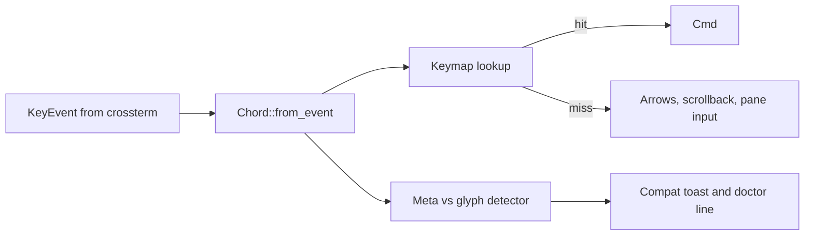

# Navigation and Keybind Rewrite — Permanent Fix Plan

Status: draft for review. Supersedes `docs/KEYBINDS.md` design section once approved.
Problem: Option-as-Meta is the top churn risk. First press of Option+h decides retention.

## 1. Why the current logic cannot be patched

`tui.rs::handle_key` is three decoders in one match:

* Alt-bit path for terminals with Option-as-Meta.
* Hand-written glyph arms for terminals without it.
* Scattered shift, Caps Lock, Kitty, Ctrl+Shift, arrow, Enter, digit cases.

`binds.rs` mirrors this by hand with per-binding `glyph: Option<char>`.
Failure modes are structural, not typos:

1. Any binding without a glyph is dead on default Apple Terminal.
2. Dead keys (Option+e,i,n,u, backtick) emit nothing until the next keystroke. Binding one earns silence.
3. The table is US-only. Other layouts either miss or get eaten.
4. `doctor` cannot tell Meta from glyph, so README tells the user to fix their terminal.
5. No `[keys]` config, no `none`, no `gwae keys --check`. Conflicts with Raycast, Magnet, iTerm2 are unresolvable.

Patching glyphs one by one preserves all five.

## 2. Goals

* Navigation works on a fresh Mac with zero terminal config.
* One decode funnel. No per-binding glyph field.
* Active detection and guidance, not README blame.
* User can rebind, unbind with `none`, and give any chord back to the pane.
* HUD, cow hints, README, and `doctor` render from the resolved keymap and cannot drift.
* Old configs and default muscle memory keep working. No flag day.

Non-goals for v1: chord sequences or tmux prefix, per-mode keymaps, configurable picker internals beyond the save key.

## 3. New architecture



### 3.1 `keys::Chord` becomes the only input type

New type in `crates/gwae/src/keys.rs`:

```rust
struct Chord { mods: Mods, key: Key }
enum Key { Char(char), Enter, Left, Right, Up, Down, Digit(u8), Other }
```

`Chord::from_event(&KeyEvent)` absorbs all normalization now scattered in `tui.rs`:

* `physical_shift` including Kitty shifted codepoints and Caps Lock exclusion.
* `logical_char` case folding.
* Complete US Option-glyph map as a layout fact: glyph to base char plus shift. Example: `˙` to `(h,false)`, `Ó` to `(h,true)`, `©` to `(g,false)`.
* Ctrl+Shift+J and K transcript scroll as chords, not special arms.

`Display` and `FromStr` share platform naming so `mod+h` parses once and prints as `⌥+h` on macOS and `Alt+h` elsewhere. Accepted spellings: `mod`, `alt`, `⌥`.

### 3.2 One glyph table, generated and tested

Delete `Bind::glyph`. Replace with one `GLYPH_MAP: &[(char, char, bool)]` covering the full US Option and Option+Shift layers, generated from a script plus a checked-in snapshot.

Rules:

* Unknown glyphs fall through to the pane. This fixes non-US layouts by construction. An unbound glyph types through instead of being eaten.
* Dead-key outputs (`´`, `ˆ`, `˜`, `` ` `` compositions) are never in the map. Binding a dead-key base earns a startup warning naming the terminal setting.
* Property test: for every ASCII key `k`, `Chord::from_event(glyph_event(k))` equals `Chord::mod_(k)`.

### 3.3 `Keymap` as data, `handle_key` as lookup

```rust
struct Keymap { order: Vec<(Chord, Command)>, lookup: HashMap<Chord, Command> }
enum Match { Exact(Command), None }
```

Shape the lookup as a single-chord map. No leaders, no sequences, no prefix keys by decision.

`handle_key` becomes: normalize, look up, and on miss do exactly what it does today for arrows, scrollback, and `Cmd::Input(key_bytes(ev))`. Parameterized commands (`JumpDigit`, `Scroll`, `ScrollBack`, `Input`) stay in code. Named verbs move to the map.

Modal overlays (theme picker, spawn-dir picker, quit confirm) stay hard-coded except one fix: the dir picker save key looks up its verb in the keymap instead of hard-coding `⌥+s`, or it lies after a rebind.

### 3.4 No leader, Windows Alt+Enter handling

No leader sequence ships. The leader was proposed for terminals that swallow Option entirely, and it is rejected: two keystroke navigation is not acceptable in gwae.

That case is handled by rebinding instead. If Option never arrives, the user rebinds the verbs they need to chords their terminal does deliver, or unbinds the conflicting chord with `none`. `gwae keys --check` plus doctor evidence makes that discoverable.

### 3.5 Config surface

In `gwae.toml`:

```toml
[keys]
"mod+w" = "kill-pane"
"mod+q" = "none"
"mod+shift+h" = "move-pane-left"
keys_clear = false
```

Semantics: merge over defaults, `none` unbinds and returns the chord to the pane, `keys_clear = true` starts blank. Unknown verbs warn and are skipped. Malformed tables leave the running keymap intact and toast. Live reload adopts keys through `adopt_appearance`. Valid verb names come from `gwae-layout::Action` plus `smart-jump`, `theme-picker`, `dir-picker`, `toggle-hud`, `toggle-keep-awake`, `quit`, scroll verbs.

### 3.6 Detection instead of documentation

Runtime detector in `tui.rs`:

* First 30 seconds or first 20 key events, classify each Option-looking input as Meta chord, ESC-prefixed chord, or glyph.
* On first glyph: enable compat mode silently and toast once: `Terminal sent ˙ not Meta. Navigation works. Enable Option-as-Meta for fewer surprises.`
* On dead-key silence risk: if the user holds Option and nothing arrives within 800ms twice, hint once.
* Never nag again after dismissal. Store dismissal in config.

`doctor` gains:

* Terminal identity: `TERM`, `TERM_PROGRAM`, `KITTY_KEYBOARD`, Ghostty, iTerm2, WezTerm, Apple Terminal detection.
* `$mod` path verdict: `meta`, `glyph-compat`, or `unknown` with evidence (last probe result, enhancement flags active).
* Keymap dump source for `gwae keys`: print effective map, `--check` validates config names, flags dead keys, flags known-hot conflicts (Raycast, Magnet, iTerm2 defaults), and exits nonzero on error for dotfile CI.

`setup` stops being a stub: per-terminal hints for enabling Option-as-Meta where supported.

### 3.7 Docs stay generated

Move `desc`, `hint`, `group` from `Bind` to `CommandInfo` keyed by verb. Cow hints render as `format!("{} {}", chord, info.hint)` over the resolved keymap. Keep `cowsay_hints()` signature but take `&Keymap`. Tests move from one hint per binding to one hint per command. README test narrows to the default keymap. `CONFIG.md` gains the `[keys]` table. `KEYBINDS.md` flips from design to implemented.

## 4. File touch list

* `keys.rs`: add `Chord`, `Mods`, `FromStr`, `Display`, glyph map, dead-key set, unit and property tests.
* `tui.rs`: replace `handle_key` body with normalize plus lookup, add detector and toast, fix dir-picker save lookup, wire leader sequences, keep `key_bytes` for pane forwarding.
* `binds.rs`: delete `glyph`, or replace `BINDS` with `COMMANDS: &[CommandInfo]` plus `default_keymap()`.
* `config.rs`: add `[keys]` table and `keys_clear`, parse with warn-and-skip, include in `adopt_appearance`.
* `cli.rs` plus `main.rs`: add `gwae keys` and `gwae keys --check`, extend `doctor` with terminal and `$mod` lines.
* `onboard.rs`: probe step during `init` that asks for one Option+h press and reports the path.
* `tests/keys_e2e.rs`: new e2e modeled on `picker_e2e.rs`. Rebind kill to `mod+w`, unbind `mod+q`, assert kill moves and `mod+q` reaches the child.

## 5. Phasing

| Phase | Scope | User visible | Est |
|---|---|---|---|
| P0 | `Chord` plus full glyph map plus `handle_key` walks default `Keymap`. Delete per-binding glyph. | None, pure refactor | 1 day |
| P1 | Detector plus toast plus `doctor` terminal and `$mod` lines plus `init` probe | Broken terminals self explain | 0.5 day |
| P2 | `[keys]` merge, `none`, `keys_clear`, live reload | Rebind and unbind | 0.5 day |
| P3 | Metadata to commands, HUD and cow from resolved map | Correct docs after rebind | 0.5 day |
| P4 | `gwae keys` plus `--check`, CONFIG table, conflict warnings | Resolvable Raycast and Magnet clashes | 0.5 day |

Land P0 alone. It deletes the live bug source even if later phases slip. Coordinate with copy and paste work that also edits `handle_key`.

## 6. Test plan

1. Glyph round-trip property over the whole map, both Meta and glyph paths dispatch identically for any keymap.
2. Caps Lock versus Shift and Kitty shifted-codepoint cases ported from existing tests.
3. Detector: synthetic Meta stream reports `meta`, synthetic glyph stream reports `glyph-compat` and toasts once.
4. Config: merge, `none` reaches pane as `Cmd::Input`, unknown verb warns and keeps default, malformed table keeps running map.
5. E2E with real PTY: default config navigates with glyph input, rebound config kills on `mod+w` and forwards `mod+q`.
6. Layout matrix: US plus one non-US layout smoke test asserting unbound glyphs type through.
7. Docs: HUD and cow render rebound chords from a non-default keymap.

## 7. Acceptance

* `gwae keys --check` passes on defaults, fails loudly on a bad verb or dead key.
* `doctor` names the terminal and the `$mod` path with evidence.
* Adding a verb without docs fails the build.
